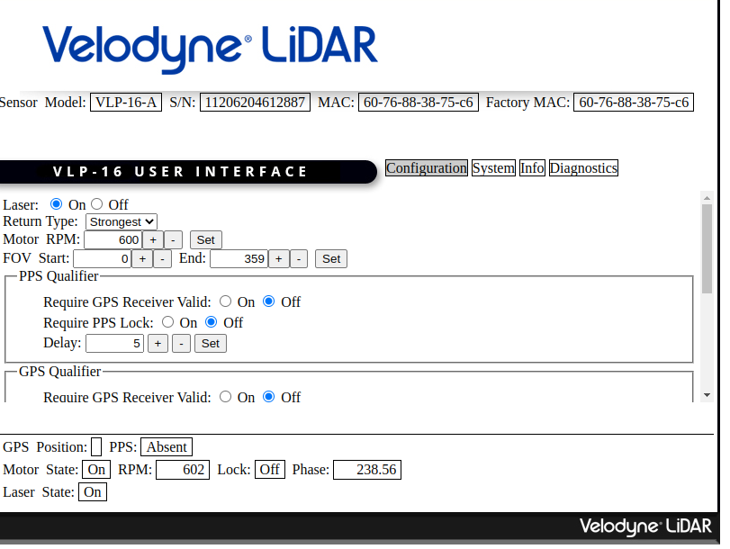
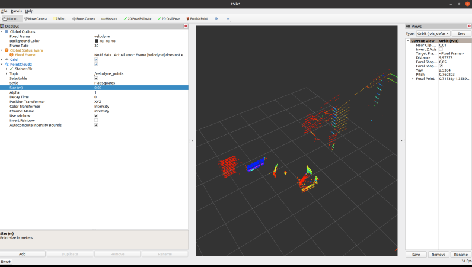

### LIDAR-DATA-VISUALIZATION-with-RVIZ 
#### Installation
* Ubuntu 20.04
* ROS2-Galactic
* Wireshark

I used VLP-16 Lidar sensor for this repository.To run VLP-16, plug in ethernet and power cables and make sure the WIFI is disconnected.
Then, it is necessary to set the IP addresses of the sensor and computer from the network connection settings.
For this, you can review the User Manual, which is the sensor's own document.Documentation link is here:
https://velodynelidar.com/wp-content/uploads/2019/12/63-9243-Rev-E-VLP-16-User-Manual.pdf.
If the IP addresses of the sensor and the computer are entered correctly, you can access the interface of the sensor with the IP of the sensor.

You can set properties from here.

Also you can check from Wireshark if you connected to sensor and take data from there.
Create a workspace folder then open a src file under it. Clone the velodyne driver repository from galactic branch.

* source /opt/ros/galactic/setup.bash
* Colcon build
* source install/setup.bash 
* ros2 launch velodyne velodyne-all-nodes-VLP16-launch.py 
* Run rviz2 another terminal
 
#### Visualization on Rviz
Change frame map as velodyne you will see results as below.

